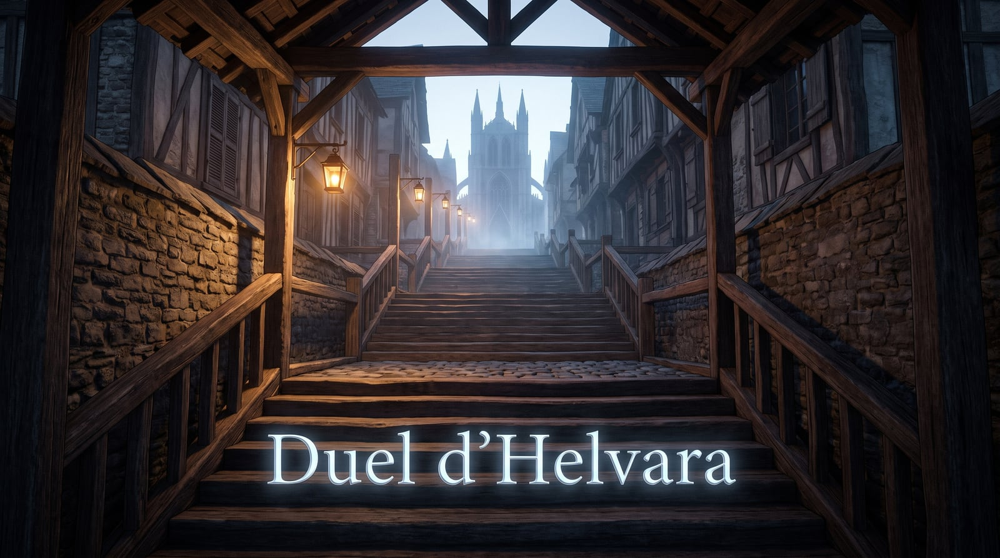
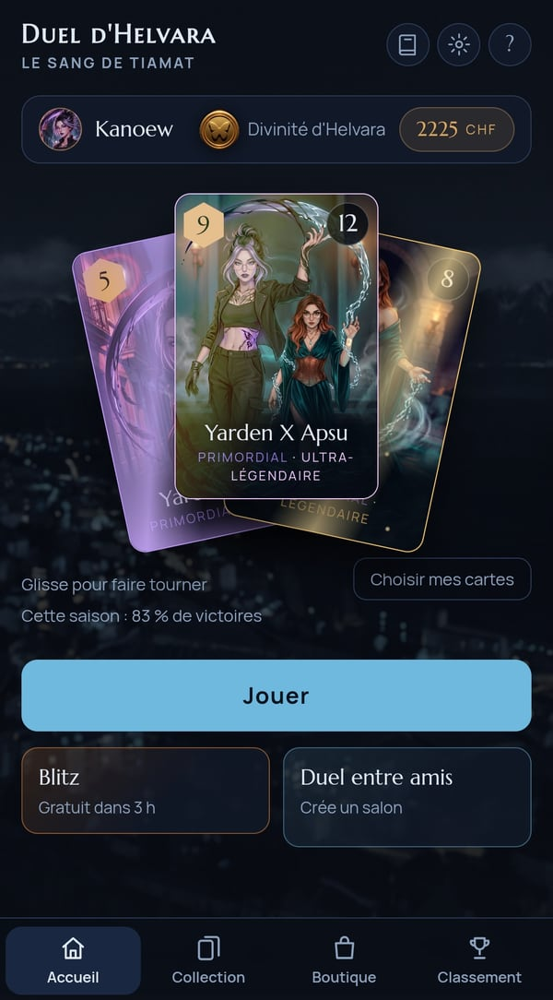
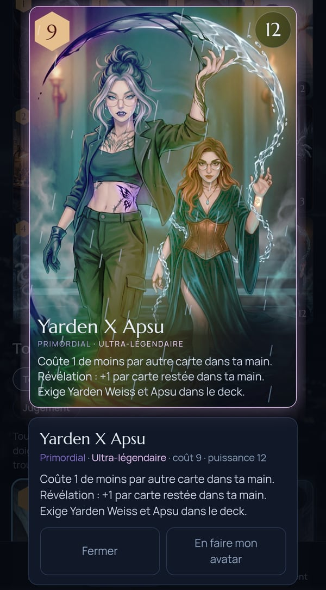
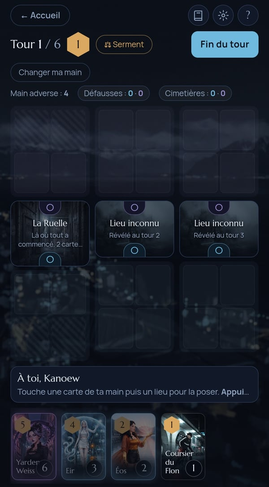

# Duel d'Helvara

🇫🇷 [Français](#-français) · 🇬🇧 [English](#-english)

👉 **Jouer / Play : https://kanoew.github.io/Duel-Helvara/**
💬 **Discord : https://discord.gg/QgxFQGcjGT**

  
  
  

---

## 🇫🇷 Français

**Duel d'Helvara** est un jeu de cartes de duel jouable directement dans ton navigateur, sans rien installer. Les parties sont rapides, sur le principe des jeux de cartes à lieux, dans l'univers d'Helvara : humains, monstres, divinités et créatures des failles s'y affrontent.

### Ce que tu peux faire
- Jouer des duels rapides avec des cartes de plusieurs factions, raretés et panthéons
- Affronter un ami avec **Duel entre amis** : un joueur crée un salon, l'autre entre le code
- Suivre ta place au **classement**
- Sauvegarder ta progression sur ton appareil, ou la retrouver partout en te connectant avec Google (facultatif)
- Jouer en français ou en anglais

### Comment jouer
1. Ouvre le lien : https://kanoew.github.io/Duel-Helvara/
2. Lance une partie, ou clique sur **Duel entre amis**
3. Pour garder ta progression sur plusieurs appareils, utilise **Se connecter avec Google** en bas de l'accueil

### Communauté
Un bug, une idée, un avis sur l'équilibrage d'une carte ? Rejoins le Discord : **https://discord.gg/QgxFQGcjGT**
Tu peux aussi ouvrir une [issue](https://github.com/Kanoew/Duel-Helvara/issues) ici.

### Technique
Jeu web en HTML/JavaScript, hébergé sur GitHub Pages. Sauvegarde, classement et salons de duel via Supabase.

### Confidentialité
Voir la [politique de confidentialité](confidentialite.html).

---

## 🇬🇧 English

**Duel d'Helvara** is a card duel game you play right in your browser, with nothing to install. Matches are quick, set in the world of Helvara, where humans, monsters, gods and rift creatures clash.

### What you can do
- Play fast duels with cards from several factions, rarities and pantheons
- Face a friend with **Duel entre amis** (friend duel): one player creates a room, the other enters the code
- Track your place on the **leaderboard**
- Save your progress on your device, or carry it everywhere by signing in with Google (optional)
- Play in French or English

### How to play
1. Open the link: https://kanoew.github.io/Duel-Helvara/
2. Start a match, or click **Duel entre amis**
3. To keep your progress across devices, use **Se connecter avec Google** (sign in with Google) at the bottom of the home screen

### Community
Found a bug, have an idea, or feedback on a card's balance? Join the Discord: **https://discord.gg/QgxFQGcjGT**
You can also open an [issue](https://github.com/Kanoew/Duel-Helvara/issues) here.

### Tech
Web game in HTML/JavaScript, hosted on GitHub Pages. Saves, leaderboard and duel rooms run on Supabase.

### Privacy
See the [privacy policy](confidentialite.html) (in French).
